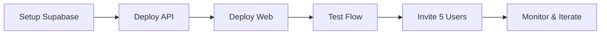

# Relay AI Beta Launch Checklist

**Date**: 2025-11-02
**Status**: Ready for deployment - Awaiting 5 GitHub secrets
**Target**: Deploy to production and invite first beta users
**Timeline**: ~40 minutes from secret setup to live

---

## Current Status

✅ **Completed:**
- Database setup on Railway (PostgreSQL)
- API deployed on Railway (relay-production-f2a6.up.railway.app)
- Monitoring setup (Prometheus + Grafana)
- GitHub Actions CI/CD automation
- Web app code ready for Vercel
- All deployment scripts prepared

⏳ **Pending:**
- 5 GitHub secrets from user (Vercel + Supabase credentials)
- Deploy web app to Vercel
- Invite beta users

---

## Phase 1: Get GitHub Secrets (10 minutes) - USER ACTION REQUIRED

### What You Need to Do

Go to these services and retrieve 5 secrets:

1. **Vercel Token**: https://vercel.com/account/tokens
   - Create token named `relay-github-actions`
   - Scope: Full account access
   - Expiration: 90 days

2. **Vercel Project ID**: https://vercel.com/dashboard → Settings → General
   - Copy "Project ID" field

3. **Vercel Org ID**: https://vercel.com/account/teams
   - Copy Team ID (or personal account ID)

4. **Supabase URL**: https://supabase.com/dashboard → Settings → API
   - Copy "Project URL" field (format: https://xxx.supabase.co)

5. **Supabase Anon Key**: https://supabase.com/dashboard → Settings → API
   - Copy "anon" public key under "Project API keys"

**Reference**: See `GITHUB_SECRETS_SETUP_GUIDE.md` for detailed instructions

# Deploy to Vercel
vercel --prod

# Or deploy to Netlify
netlify deploy --prod
```

- [ ] Install dependencies
- [ ] Set NEXT_PUBLIC_SUPABASE_URL
- [ ] Set NEXT_PUBLIC_SUPABASE_ANON_KEY
- [ ] Set NEXT_PUBLIC_API_URL
- [ ] Deploy and get URL

### 4️⃣ **Invite Beta Users (10 min)**
```bash
# Update BETA_USERS list in script
nano scripts/invite_beta_users.py

# Send invites
python scripts/invite_beta_users.py
```

- [ ] Add 5-10 beta users to list
- [ ] Run invitation script
- [ ] Join Slack for support

### 5️⃣ **Test Everything (20 min)**
- [ ] Sign up with test email
- [ ] Upload a PDF file
- [ ] Run a search query
- [ ] Check usage tracking works
- [ ] Submit feedback
- [ ] View security headers

---

## 📊 Beta Metrics Dashboard

```python
# Check your metrics anytime:
python scripts/invite_beta_users.py metrics

# Or query Supabase directly:
SELECT COUNT(*) as users FROM profiles WHERE beta_access = true;
SELECT COUNT(*) as queries FROM queries WHERE created_at > NOW() - INTERVAL '24 hours';
SELECT type, message FROM feedback ORDER BY created_at DESC LIMIT 10;
```

---

## 🔧 Configuration Files

### `.env.local` (API)
```env
RELAY_ENV=staging
DATABASE_URL=postgresql://...
SUPABASE_URL=https://...
SUPABASE_JWT_SECRET=...
OPENAI_API_KEY=sk-...
CORS_ORIGINS=https://your-app.vercel.app
```

### `.env.local` (Web)
```env
NEXT_PUBLIC_SUPABASE_URL=https://...
NEXT_PUBLIC_SUPABASE_ANON_KEY=eyJ...
NEXT_PUBLIC_API_URL=https://your-api.railway.app
```

---

## 🎯 Beta Success Metrics

Track these daily:
- **Signups:** Target 2-3/day
- **Active Users:** 50% should return daily
- **Queries:** 20-50 per active user
- **Files:** 2-5 uploads per user
- **Feedback:** 1 piece per 5 users

---

## 🚨 Common Issues & Fixes

### "Database connection failed"
```bash
# Check DATABASE_URL format:
postgresql://postgres:[password]@[host]:5432/postgres

# Test connection:
psql $DATABASE_URL -c "SELECT 1"
```

### "CORS error in browser"
```bash
# Add your frontend URL to CORS_ORIGINS:
CORS_ORIGINS=https://your-app.vercel.app,http://localhost:3000
```

### "File upload fails"
```bash
# Check Storage bucket exists:
# Go to Supabase > Storage > Create bucket "user-files"
# Set to public or add RLS policies
```

### "Authentication not working"
```bash
# Verify JWT secret matches:
# Supabase Dashboard > Settings > API > JWT Secret
# Must match SUPABASE_JWT_SECRET in .env
```

---

## 📱 Beta Communication

### Welcome Email Template
```
Subject: 🚀 Your Relay AI Beta Access is Ready!

Hi [Name],

Your beta access is active! Here's how to get started:

1. Go to: https://relay-beta.vercel.app
2. Sign in with this email
3. Upload your first document
4. Try searching for something

Quick tips:
- You have 100 free queries/day
- PDFs work best for now
- Feedback button is in the app

Questions? Reply to this email or join our Slack.

Best,
Kyle
```

### Daily Check-in
```python
# Run this each morning:
python scripts/invite_beta_users.py metrics

# Email active users:
"How's your experience so far? Any issues?"
```

---

## 🎬 Go-Live Sequence



1. **Hour 0:** Database + Auth ready
2. **Hour 1:** API deployed and tested
3. **Hour 2:** Web app live
4. **Hour 3:** First 5 users invited
5. **Day 1:** Gather feedback, fix bugs
6. **Day 2:** Invite 10 more users
7. **Week 1:** Iterate based on feedback

---

## 🔑 The ACTUAL Next Steps

Right now, do this:

```bash
# 1. Create Supabase project (2 min)
open https://supabase.com/dashboard

# 2. Copy credentials to .env.local (1 min)
cp .env.beta.example .env.local
# Fill in your values

# 3. Run database setup (2 min)
# Paste scripts/setup_supabase_beta.sql into SQL editor

# 4. Deploy API to Railway (5 min)
cd relay_ai
railway up

# 5. Deploy web to Vercel (5 min)
cd product/web
vercel --prod

# 6. Test it yourself (5 min)
open https://your-app.vercel.app/beta

# Total: 20 minutes to beta!
```

---

## ✨ You're Ready!

With this setup:
- ✅ Secure multi-tenant database (RLS enabled)
- ✅ Authentication with magic links
- ✅ File upload and search working
- ✅ Usage tracking and limits
- ✅ Feedback collection system
- ✅ Professional beta UI

**Ship it!** Start with 5 users today. Fix issues. Add 10 more tomorrow.

---

**Questions?** The setup is intentionally simple. Complexity comes later.

Remember: A working beta with 10 real users beats perfect code with 0 users.

Good luck! 🚀
